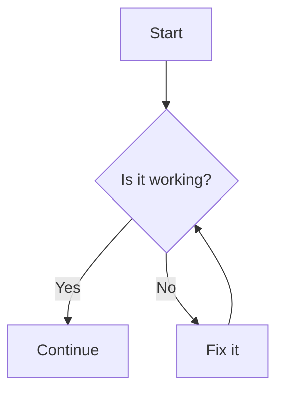
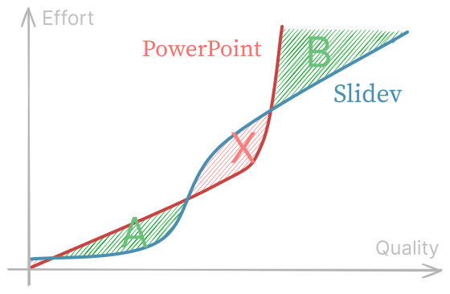
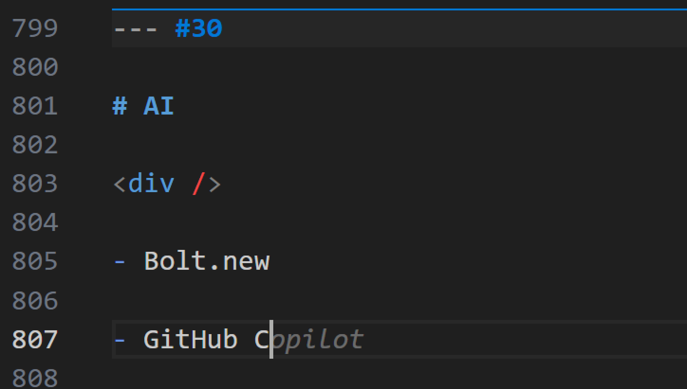
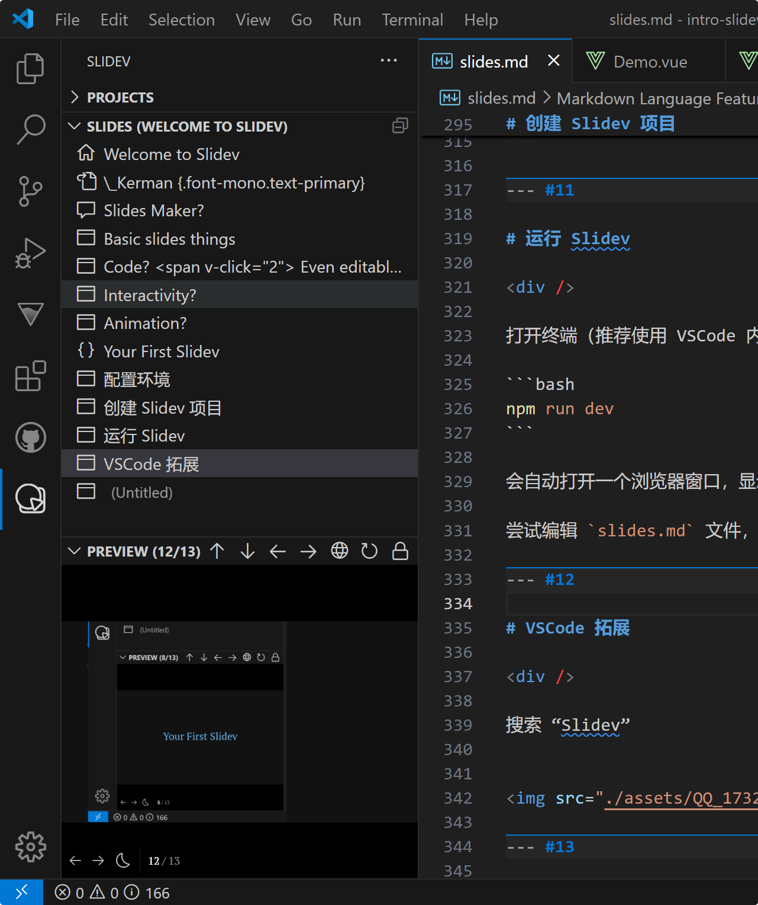
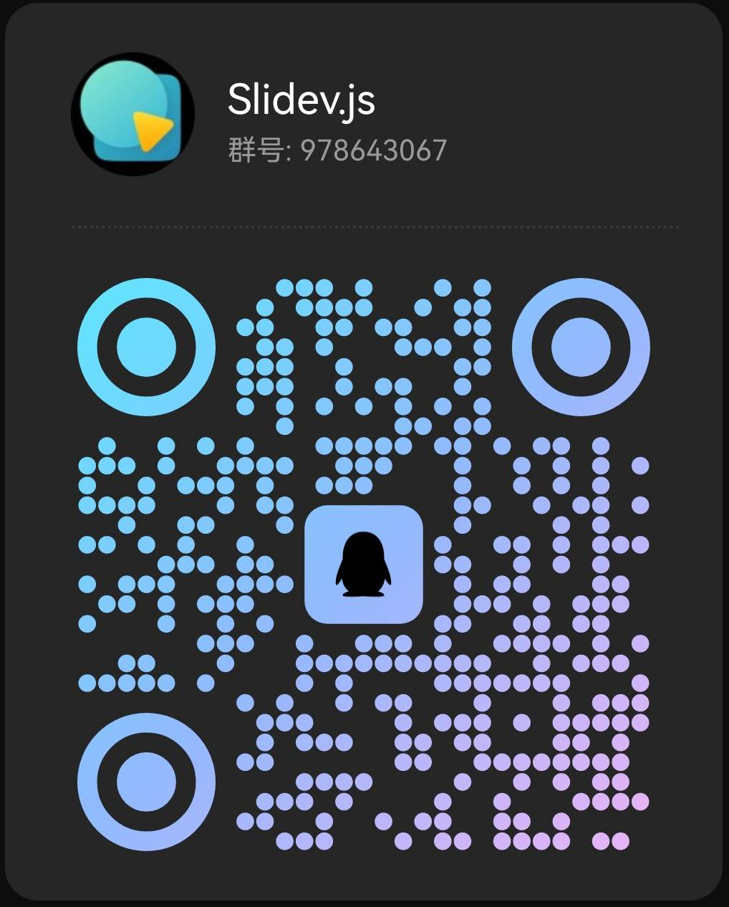

<div text-7xl class="text-#6fcaff" style="text-shadow: 0px 0px 2px #555">
Slidev
</div>

<div mt-2 text-2xl op-90 style="text-shadow: 0px 0px 8px black">
Presentation slides for developers
</div>

<div abs-br text-right op-60 text-sm mb-4 mr-4>
  by _Kerman <br>
  SFD 2025
</div>

<!-- to preload the modules -->
<Demo hidden />

---
transition: fade-out
layout: intro
class: mx-14 my-12
---

# \_Kerman {.font-mono.text-primary}

<div class="leading-8">
Slidev 团队成员 <br>
USTC 本科 2023级
</div>

<div my-6 mb-22 w-min flex flex-col font-mono op80>
  <div flex items-center gap-2>
    <ri-github-line op50/>
    <a href="https://github.com/kermanx" target="_blank">github.com/kermanx</a>
  </div>
  <div flex items-center gap-2>
    <ri-twitter-x-line op50/>
    <a href="https://x.com/kermanx_" target="_blank">x.com/kermanx_</a>
  </div>
  <div flex items-center gap-2>
    <ri-bluesky-line op50/>
    <a href="https://bsky.app/profile/kermanx.github.io" target="_blank">@kermanx.github.io</a>
  </div>
</div>


<div flex="~ gap2">

</div>

---
transition: fade-out
class: flex flex-col items-center justify-center
---

<div text-4xl pb-2 op-90>
Yet Another
</div>
<div text-6xl text-primary mb-10>
Slides Maker?
</div>

---
layout: none
zoom: 0.7
preload: false
---

<Demo />

---
transition: slide-left
---

# Math?

Supports $\KaTeX$, a subset of $\LaTeX$.

$$ {1|2|all}
\begin{aligned}
\nabla \cdot \vec{E} &= \frac{\rho}{\varepsilon_0} \\
\nabla \cdot \vec{B} &= 0 \\
\nabla \times \vec{E} &= -\frac{\partial\vec{B}}{\partial t} \\
\nabla \times \vec{B} &= \mu_0\vec{J} + \mu_0\varepsilon_0\frac{\partial\vec{E}}{\partial t}
\end{aligned}
$$

---
transition: slide-left
---


# Diagrams?

Mermaid.js / PlantUML / Custom renderer

<div w-90 mt-14>

````md
  ```mermaid
  graph TB
    A[Start] --> B{Is it working?}
    B -- Yes --> C[Continue]
    B -- No --> D[Fix it]
    D --> B
  ```
````

</div>

<div abs-tr mr-24 mt-12>



</div>

---
clicks: 2
transition: slide-left
---

# Code? <span v-click="2"> Even editable! </span>

<span v-if="$clicks < 1">It couldn't be simpler!</span>
<span v-else-if="$clicks < 2">"Shiki Magic Move"!</span>
<span v-else>"Monaco Editor"!</span>

<div v-show="$clicks < 2">

````md magic-move
```cpp
#include <stdio.h>

int main() {
  printf("Hello, Slidev!\n");

  for (int i = 0; i < 10; i++) {
    printf("%d\n", i);
  }
}
```

```cpp
#include <iostream>

int main() {
  std::cout << "Hello, Slidev!" << std::endl;

  for (int i : std::views::iota(0, 10)) {
    std::cout << i << std::endl;
  }
}
```
````

</div>

<div v-show="$clicks >= 2">

```ts {height: 'auto'}
import { ref, watchEffect } from 'vue'

const a = ref(1)

watchEffect(() => {
  console.log(a.value)
})
```

</div>

---
transition: slide-left
---

# Interactivity?


<iframe fixed left-16 top-34 w-80 h-50 scale-90 origin-left-top src="https://www.youtube.com/embed/dQw4w9WgXcQ?si=hCnWGH-S8ML-hjau" title="YouTube video player" frameborder="0" allow="accelerometer; autoplay; clipboard-write; encrypted-media; gyroscope; picture-in-picture; web-share" referrerpolicy="strict-origin-when-cross-origin" allowfullscreen></iframe>

<div v-drag="[450,75,242,287]" v-motion :initial="{opacity: 0}" :enter="{ opacity: 1, transition: { duration: 2000 } }">
<TresCanvas v-bind="state">
  <Scene />
</TresCanvas>
<div op-60 abs-br text-xs>
by <span italic>Alvaro Saburido</span>
</div>
</div>


<!-- vue script setup scripts can be directly used in markdown, and will only affects current page -->
<script setup lang="ts">
const final = {
  x: 0,
  y: 0,
  rotate: 0,
  scale: 1,
  transition: {
    type: 'spring',
    damping: 10,
    stiffness: 20,
    mass: 2
  }
}

import { TresCanvas } from '@tresjs/core';
import { onMounted, reactive, ref } from 'vue';
import { BasicShadowMap, NoToneMapping, SRGBColorSpace } from 'three';
import Scene from './components/Scene.vue';

const state = reactive({
	alpha: true,
	transparent: true,
	shadowMapType: BasicShadowMap,
	outputColorSpace: SRGBColorSpace,
	toneMapping: NoToneMapping,
});
</script>

---

# 什么时候用 Slidev?




<div v-drag="[445,144,226,55]">

<div pl-2>
<span class="text-#6BC07B font-mono font-bold">A</span><span font-mono op-50 ml--1px>.</span> 尽快做完，质量不差就行<br>
<span class="text-#6BC07B font-mono font-bold">B</span><span font-mono op-50 ml--1px>.</span> 追求效果，需要调整细节
</div>

</div>

---

<div grid grid-cols-2 gap-16>
<div>

# 创建 Slidev 项目

- 安装 Node.js

  <span font-mono text-blue-300>https://nodejs.org/</span>

- 创建 Slidev 项目

```bash
  npm create slidev@latest
```

- 进入项目目录

```bash
  cd my-slidev
```

</div>
<div>

# 启动开发环境

- 打开 VSCode

```bash
  code .
```

- 安装依赖

```bash
  npm install
```

- 运行

```bash
  npm run dev
```

</div>
</div>

---

# 实时预览

<div />

对幻灯片的任何修改都会实时反映在浏览器中，无须等待与刷新

<div text-center mt-24 text-2xl b p-4>Live Demo</div>

---

# AI

<div />

<div grid grid-cols-2 gap-8 mb-12>
<div>

- Bolt.new

<video src="./assets/boltnew.mp4" autoplay loop muted w-80 mt-4 float-right />

</div>
<div>

- GitHub Copilot / Cursor / ...

{.w-100.text-right.mt-4}

</div>
</div>

---

# VSCode 拓展

<div h-8 />

- [点击 Slidev 图标]{.text-red}
- [幻灯片导航]{.text-yellow}
- [幻灯片预览]{.text-green}



<div border="2 red rounded" v-drag="[404,224,40,43]" />

<div border="2 yellow rounded" v-drag="[445,52,177,207]" />

<div border="2 green rounded" v-drag="[445,260,182,167]" />

---

# 分享幻灯片

<div h-4 />

- 直接投屏 <span float-right op-80 mr-6>简单直接</span>

- 局域网访问 <span float-right op-80 mr-6>输入 IP 地址，享受实时同步</span>

- 导出到 PPTX / PDF <span float-right op-80 mr-6>满足提交要求</span>

- 部署到网站（如 GitHub Pages） <span float-right op-80 mr-6>非常方便!</span>


---

# 更多功能，参见文档 <span text-2xl ml-4 text-white class="font-mono"> https://cn.sli.dev </span>

<div h-1 />

<iframe src="https://cn.sli.dev/features/" class="origin-left-top w-150% scale-67"  h-160 />

---

<div h-8 />

# 加入我们的社区

欢迎提问和交流！

<div mt-8>

<carbon-earth-europe-africa-filled /> Website: https://sli.dev <div h-2/>
<carbon-logo-github /> GitHub: <a href="https://github.com/slidevjs/slidev">slidevjs/slidev</a> <div h-2/>
<carbon-logo-discord /> Discord: https://chat.sli.dev <div h-2/>
<cib-tencent-qq /> QQ Group: <a href="https://qm.qq.com/q/2F8dmbAFgY">978643067</a>

</div>



<style>
a {
  @apply text-xl font-mono text-blue2;
}

li {
  @apply leading-10 text-xl;
}
</style>

---
layout: end
---

谢谢大家！
